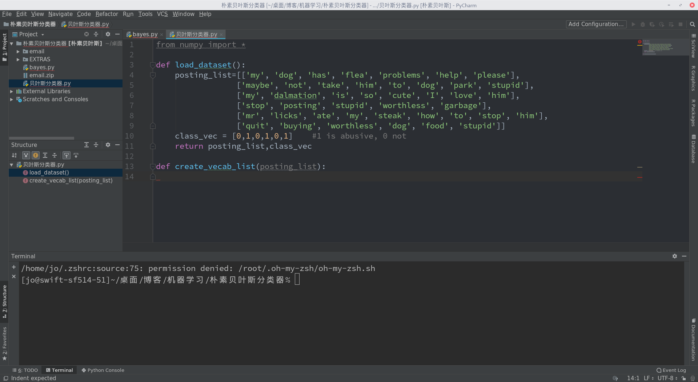

# OneDark-style
一个OneDark风格的Pycharm配色方案.
# 安装
- 下载文件
- 打开Pycharm
- 文件->导入设置->选择OneDark-style.zip

# OneDark-style
A OneDark-style Pycharm color scheme.
# Install
- Clone the file
- Open Pycharm
- File->Import Settings->Choose OneDark-style.zip

-----------------------------

现在jetbrains有更好的插件/主题了，个人偏向使用 AtomOneDarkByMayke

2020/1/3 更新

Now jetbrains support some awesome OneDark-like themes, I prefer to AtomOneDarkByMayke.

2020/1/3 Updated.
